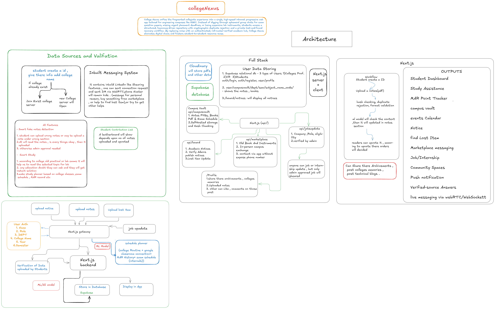

# College Nexus

> Engineering students lose precious study time and academic equipment because campus communication is fragmented across chaotic, unindexed WhatsApp groups.

---

## The Idea

College Nexus unifies the fragmented collegiate experience into a single, high-speed intranet progressive web app tailored for engineering campuses like KGEC. Instead of digging through ephemeral group chats for exam question papers, missing urgent placement deadlines, or losing expensive lab instruments, students access a structured, taxonomy-driven repository with cryptographic duplicate rejection and a private lost-and-found recovery workflow. By replacing noise with an authenticated, roll-number-verified academic hub, College Nexus eliminates digital chaos and fosters student-to-student resource reuse.

---

## Sketch

<!-- Excalidraw only. The static export below is the supplied architecture sketch. -->

[View live board (Excalidraw)](https://excalidraw.com/#json=ZdbV_98_QA8lBqWh4aku1,nrO2Iy2e8zKlIU-QbdszBA)

> The static backup is the supplied technical approach sketch from Excalidraw.

---

## Documents

- [Product Requirements](./docs/PRD.md)
- [Architecture](./docs/ARCHITECTURE.md)
- [API Spec](./docs/API_SPEC.md)
- [Roadmap](./docs/ROADMAP.md)
- [Requirements](./docs/REQUIREMENTS.md)

---

## Planned Stack

| Layer | Technology | Why |
|---|---|---|
| Framework | Next.js 14 App Router (React + TypeScript) | Delivers server-side rendering for instant First Contentful Paint, modular API routes without separate server maintenance, and seamless PWA manifest integration for mobile installability. |
| Database | PostgreSQL (hosted on Supabase) | Enforces strict relational foreign keys across departmental hierarchies and natively supports Row Level Security (RLS) for privacy. |
| Auth | Supabase Auth | Provides turnkey JWT session handling, secure HTTP-only cookies, and customizable metadata claims for institutional roll numbers and role-based permissions without rolling custom crypto code. |
| Hosting | Vercel (Edge CDN) + Supabase Cloud | Provides managed deployment, authentication, relational data, and edge delivery for the Next.js client and API routes. |
| Object Storage | Cloudinary | Stores PDFs and other uploaded assets separately from application and relational data. |
| AI / ML | Content validation and study assistance model | Checks uploaded content and approved sources, then powers study assistance and verified-source answers. |

---

## What I'm Building Toward

One paragraph per level, written before you start building it:

**Kenshi (frontend):** At Kenshi, I will deliver a complete, highly polished Progressive Web App (PWA) client built with Next.js 14 and Tailwind CSS that operates entirely on high-fidelity mock data. Visually, students will experience a responsive mobile-first shell featuring sticky search, departmental taxonomy dropdowns, and bottom navigation. Functionally, users will be able to browse and filter previous year question papers (PYQs) and notes by subject code in Campus Vault, inspect official circulars and lost equipment cards with interactive private claim modals on The Board, explore used drawing instruments and textbooks in the Marketplace with slide-out seller chat drawers, and view verified student profile badges with masked telephone numbers.

**Samurai (full-stack):** At Samurai, I will replace all mock interactions with an end-to-end production backend powered by PostgreSQL on Supabase, authenticated via Supabase Auth with student roll-number format verification. I will implement strict Row Level Security (RLS) policies so students can only modify their own items while Class Representatives (`CR`) and Admins hold broadcast permissions. Cloudinary will store PDF notes, item photos, and other uploaded assets, with client-side SHA-256 pre-flight hashing rejecting duplicate files. Real-time direct messaging and item claim handovers will use WebRTC/WebSockets, complemented by schedule planning across college routine, Google Classroom, and MAR history.

**Shogun (production):** At Shogun, College Nexus will transition into a battle-tested, production-deployed system hosted on Vercel and Supabase Cloud, validated by onboarding at least 25 active, verified students across two distinct engineering departments (CSE and ECE) at Kalyani Government Engineering College. Success will be evidenced by students downloading 50+ verified exam resources, resolving real Lost & Found claims and Marketplace exchanges, and receiving category-filtered PWA web push notifications for urgent academic updates. Additionally, I will demonstrate AI study assistance that checks approved campus Vault sources and returns verified-source answers.

---

*Submitted to Journey to Mastery — Level 1: Ronin*
