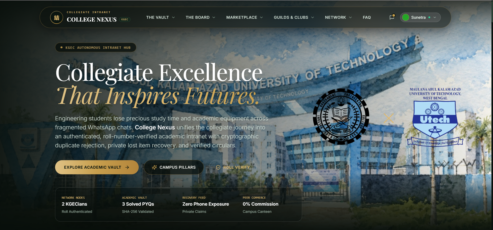
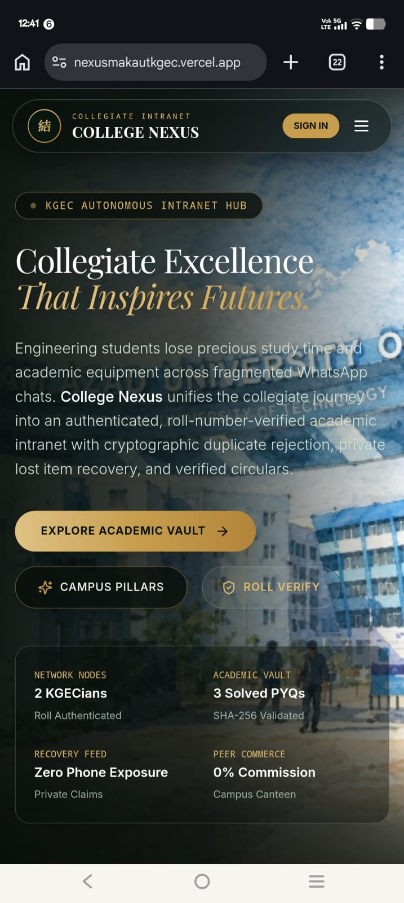

# College Nexus

> An authenticated collegiate intranet and academic portal designed to replace fragmented WhatsApp groups with an authenticated, roll-number-verified academic hub for engineering students.

[](https://nexusmakautkgec.vercel.app)
[](https://github.com/Bar-7150/College-Nexus)

---

## Preview

| Desktop | Mobile |
|---|---|
|  |  |

---

## What It Does

College Nexus unifies the fragmented engineering college experience into an authenticated, high-performance academic intranet. Engineering students lose precious study hours and laboratory equipment across noisy WhatsApp group chats. With College Nexus, students can instantly discover and download previous year question papers (PYQs) and syllabus notes filtered by department and semester, securely report and privately claim lost campus items without exposing phone numbers, and trade lab equipment and engineering textbooks at zero commission.

---

## Features

- **Academic Vault** — Search and filter semester-wise PYQs and study notes with real-time taxonomy filtering and cryptographic duplicate prevention.
- **Recovery Feed (Lost & Found)** — Anonymous campus lost-and-found reporting with category tagging and private claim verification to prevent public phone exposure.
- **Peer Commerce (Canteen Marketplace)** — Zero-commission peer-to-peer exchange for engineering calculators, drafters, aprons, and textbooks.
- **Institutional Roll Verification** — Roll-authenticated student profiles with department badges and institutional identity validation.
- **Campus Community Guilds** — Departmental discussion feeds and student communities with spam-free collegiate discourse.

---

## Planning Docs

- [PRD](./docs/PRD.md)
- [Architecture](./docs/ARCHITECTURE.md)
- [Roadmap](./docs/ROADMAP.md)

**Deviations from the plan:** None. The core frontend architecture strictly follows the original Level 1 PRD specifications, delivering the Academic Vault, Recovery Feed, Peer Marketplace, and Institutional Roll Verification with responsive mobile-first views and live database metrics.

---

## Tech Stack

| Technology | Purpose |
|---|---|
| Next.js 14 (App Router) | Core React framework providing SSR, file-system routing, and high-performance client rendering |
| TypeScript | Type safety, maintainability, and compile-time contract enforcement |
| Tailwind CSS | Curated dark luxury styling system (`#070e0a` obsidian and `#c79e4d` gold palette) |
| Lucide React | Lightweight, consistent iconography across all interface modules |
| Supabase (Auth & DB) | Institutional user management, live stats aggregation, and academic resource metadata |
| Cloudinary | Optimized storage and CDN delivery for student avatar uploads and document attachments |
| Vercel | Production hosting, edge network CDN distribution, and continuous deployment |

---

## Run Locally

```bash
git clone https://github.com/Bar-7150/College-Nexus.git
cd College-Nexus
npm install
cp .env.example .env.local
# fill in your .env.local values (Supabase, Cloudinary credentials)
npm run dev
```

Open [http://localhost:3000](http://localhost:3000) in your browser to explore College Nexus.

---

## Environment Variables

| Variable | Description |
|---|---|
| `NEXT_PUBLIC_SUPABASE_URL` | Public API endpoint URL for Supabase backend project |
| `NEXT_PUBLIC_SUPABASE_ANON_KEY` | Public anonymous client key for client-side queries |
| `SUPABASE_SERVICE_ROLE_KEY` | Server-side administrative key for verification workflows and stats count |
| `NEXT_PUBLIC_ADMIN_EMAIL` | Administrator email address authorized for privileged moderation |
| `CLOUDINARY_CLOUD_NAME` | Cloudinary cloud identifier for media uploads |
| `CLOUDINARY_API_KEY` | API key for authenticated server-side Cloudinary operations |
| `CLOUDINARY_API_SECRET` | Secret key for Cloudinary asset signature validation |
| `NEXT_PUBLIC_SERVER_URL` | Optional auxiliary backend server endpoint for real-time services |

---

## What I Learned

Designing College Nexus pushed me to master dark luxury visual hierarchy, specifically balancing high-contrast emerald obsidian glassmorphism with readable gold typography that feels authoritative rather than noisy. The most challenging aspect was architecting responsive layout primitives that scale cleanly from compact 375px mobile screens to wide 1280px desktops without layout shift or truncated data. I am most proud of the custom frosted glass scroll-reveal animations and the live metrics counters, which bridge instant visual feedback with live collegiate database activity.

---

*Submitted to Journey to Mastery — Level 2: Kenshi*
